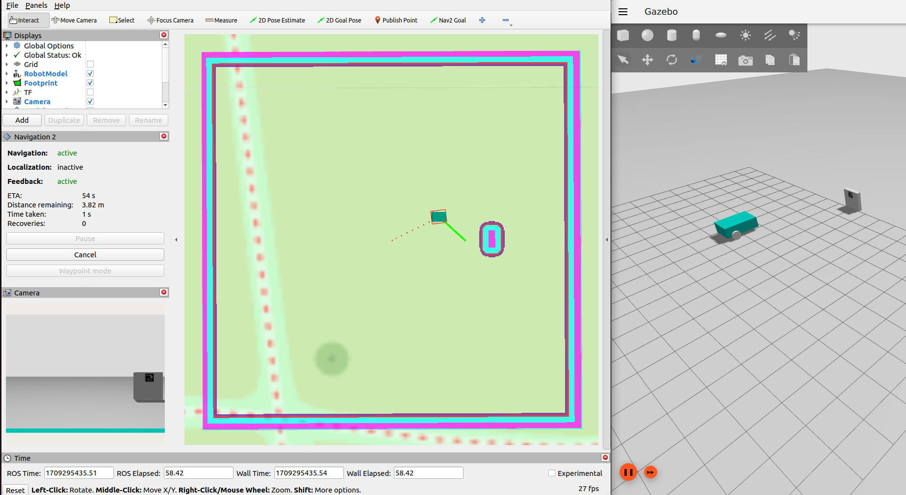

# SMART diffbot
Generic diff drive robot simulated in Gazebo for testing outdoor GNSS based navigation using Nav2. 

It supports namespacing and multiple robots in one simulation. Tested for ROS 2 Humble and Gazebo Fortress. 

Developed by the Smart Mechatronics And RoboTics (SMART) Research Group of Saxion University of Applied Sciences. Supported by Regiorgaan SIA project RAAK-MKB Autonomous Agricultural Navigation (RAAK.MKB16.016).



# Install 

### Dependencies from binaries
#### Robot modeling
```bash
sudo apt install ros-humble-xacro
sudo apt install ros-humble-joint-state-publisher
sudo apt install ros-humble-joint-state-publisher-gui
```

#### Gazebo Fortress
```bash
sudo apt install ignition-fortress
sudo apt install ros-humble-ros-gz
```

#### ros2_control
```bash 
sudo apt install ros-humble-ros2-control
sudo apt install ros-humble-ros2-controllers
```

#### Aruco detection
```bash 
pip3 install transforms3d opencv-contrib-python==4.6.0.66
sudo apt-get install ros-humble-tf-transformations
```

#### Localization 
```bash
sudo apt install ros-humble-robot-localization
```

#### Navigation
```bash
sudo apt install ros-humble-navigation2
```

### The SMART diffbot packages
Clone the `smart_diffbot` repository to the `src` folder of your ROS 2 workspace. 

Some dependencies are not available as binary installs for ROS 2 Humble. These are included as submodules to this package. These include:

* [gz_ros2_control](https://github.com/ros-controls/gz_ros2_control.git) 
* [rviz_satellite](https://github.com/blacksoul000/rviz_satellite.git)
* [ros2_arcuo](https://github.com/JMU-ROBOTICS-VIVA/ros2_aruco.git)

They are available as submodules to this package and they can be added by running inside of the `smart_diffbot` folder:
```bash 
git submodule init
git submodule update
```

Now navigate back to your ROS 2 workspace folder and colcon build.
```bash
source /opt/ros/humble/setup.bash
colcon build --symlink-install 
source install/setup.bash
```

# Examples

Example launch files are provided which start a Gazebo world with the simulated SMART diffbot(s).

A world with one robot and a docking station, without any namespacing:
```bash
ros2 launch smart_diffbot_bringup single_robot_sim_example.launch.py
```

RViz can be used to give this robot a goal position to navigate to and to localize it on a map:
```bash
ros2 launch smart_diffbot_navigation rviz.launch.py
```

To view the map, switch on the AerialMapDisplay in the Displays window of RViz.

To set a goal pose, click the "2D Goal Pose" button in the upper bar and select a location on the map where you want the robot to go. 

To send a docking command, use:
```bash
ros2 run smart_diffbot_clients docking_client
```

Another example launches an empty world with two robots, including namespacing:
```bash
ros2 launch smart_diffbot_bringup multi_robot_sim_example.launch.py
```

Although there is no actual hardware of the SMART diffbot, a dummy hardware interface has also been included in this package to demonstrate how a similar package could be set up for an actual robot with simple switching between simulation and hardware control. It would be a matter of setting a `sim` argument to `false` in the main robot launch file. 

# Basic use 
The robot can be used in any Gazebo world that includes spherical coordinates (such that GNSS data is available) and a bridged clock from Gazebo to ROS 2. The included worlds can be used as examples. 

With a world running, the robot can be spawned and started using:

```bash
ros2 launch smart_diffbot_bringup main.launch.py
```

Using `use_namespace:=true` namespacing is activated. The namespace is equal to the robot name, which can be altered by adding a `robot_name` argument. The camera can be disabled by adding the `camera:=false` argument. Currently, the simulation only supports a maximum of one robot with a camera in the same world. In case of multiple robots in one simulation, make sure to disable the camera on the others. Furthermore, spawn positions and robot colors can be altered using arguments to this launch file. See the multi_robot_example launch file as an example. 

# Development use - seperation of control, localization and navigation
For development purposes it is convenient to (instead of using the main launch file) spawn the robot and launch its control, localization and navigation software in seperate terminals. In the main launch file, these are all combined. This way, if you are developing one of the components, you only have to restart that component after a change in software instead of restarting the whole simulation.

### Test the robot simulation
Start a Gazebo world, by default the empty world:
```bash
ros2 launch smart_diffbot_bringup gazebo_world.launch.py
```

Spawn the robot: 
```bash
ros2 launch smart_diffbot_bringup simulation.launch.py
```

### Test the controllers
Start the controllers:
```bash
ros2 launch smart_diffbot_control control.launch.py
```

You can use a keyboard teleop node to move the robot around using keyboard:
```bash
ros2 run teleop_twist_keyboard teleop_twist_keyboard --ros-args -r /cmd_vel:=/diff_drive_controller/cmd_vel_unstamped
```

You can open RViz and check control and check the base_link => odom transform:
```bash
ros2 launch smart_diffbot_control rviz.launch.py
```

### Test localization
On top of control, run localization:
```bash
ros2 launch smart_diffbot_localization localization.launch.py
```

You can again use a keyboard teleop node to move the robot around using keyboard:
```bash
ros2 run teleop_twist_keyboard teleop_twist_keyboard --ros-args -r /cmd_vel:=/diff_drive_controller/cmd_vel_unstamped
```

You can open RViz and check the base_link => odom => map transform:
```bash
ros2 launch smart_diffbot_localization rviz.launch.py
```

To view the satellite map, switch on the AerialMapDisplay in the Displays window of RViz.

### Test navigation
On top of control and localization, run navigation:
```bash
ros2 launch smart_diffbot_navigation navigation.launch.py
```

Open RViz and check the navigation behaviour by setting a 2D Goal Pose on the map:

```bash
ros2 launch smart_diffbot_navigation rviz.launch.py
```

To view the satellite map, switch on the AerialMapDisplay in the Displays window of RViz.